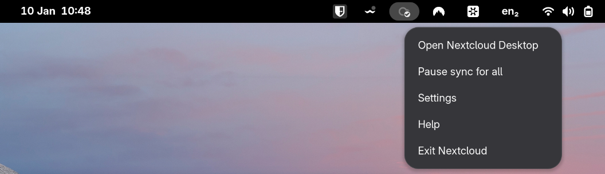
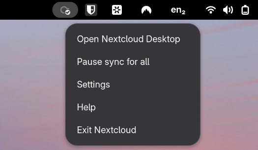
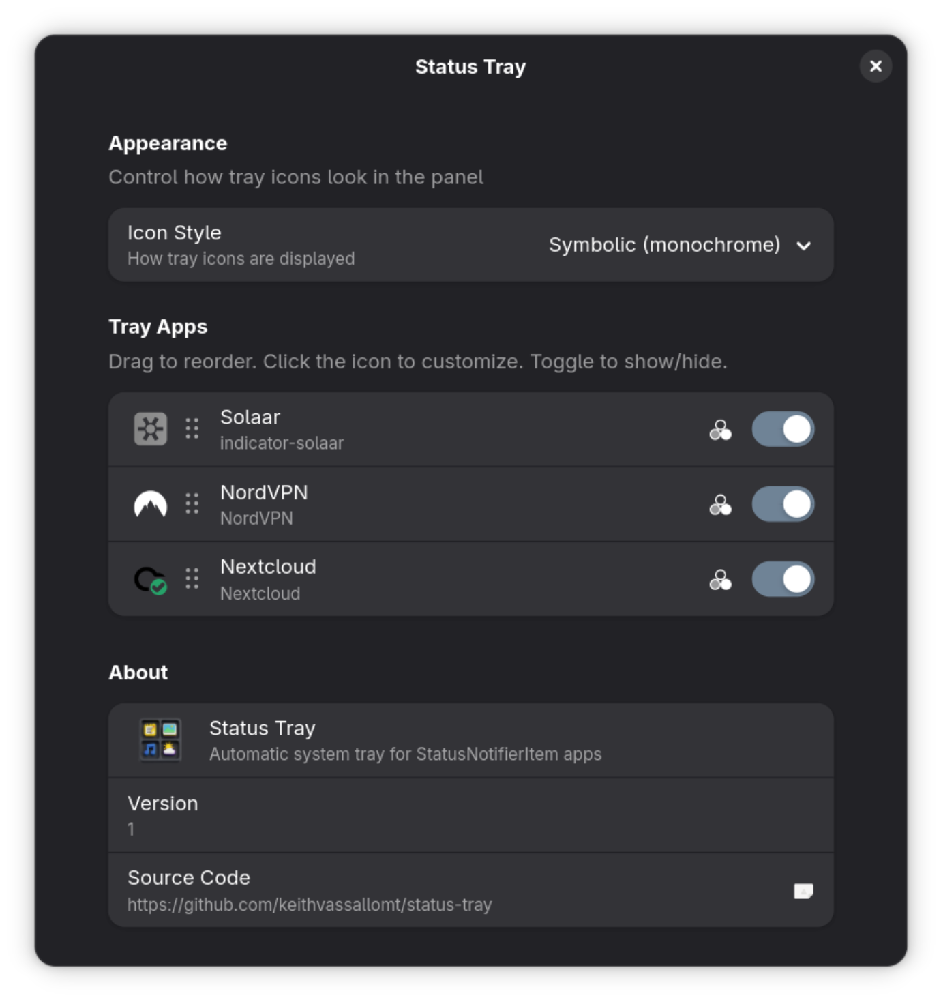
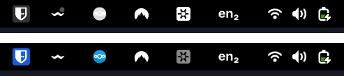
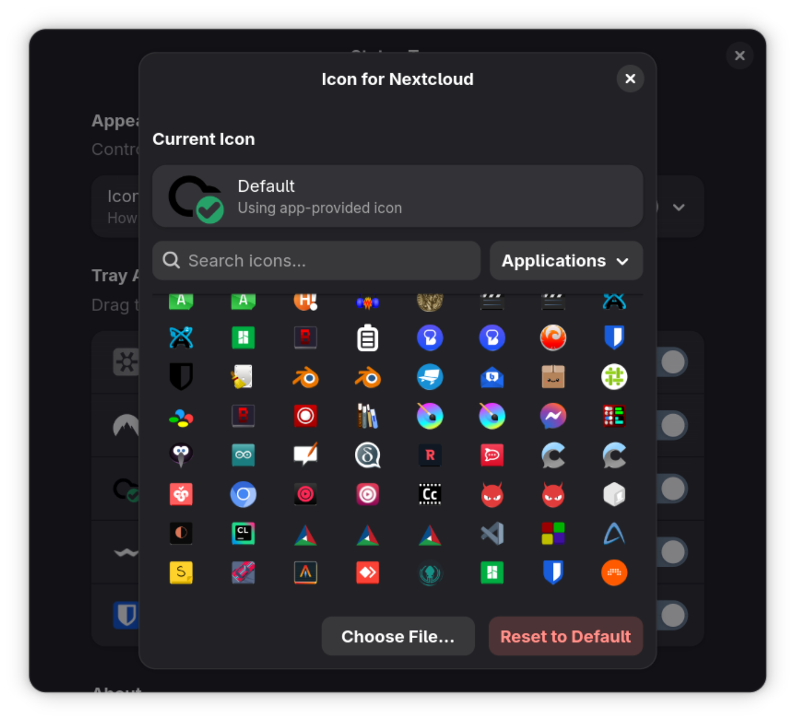
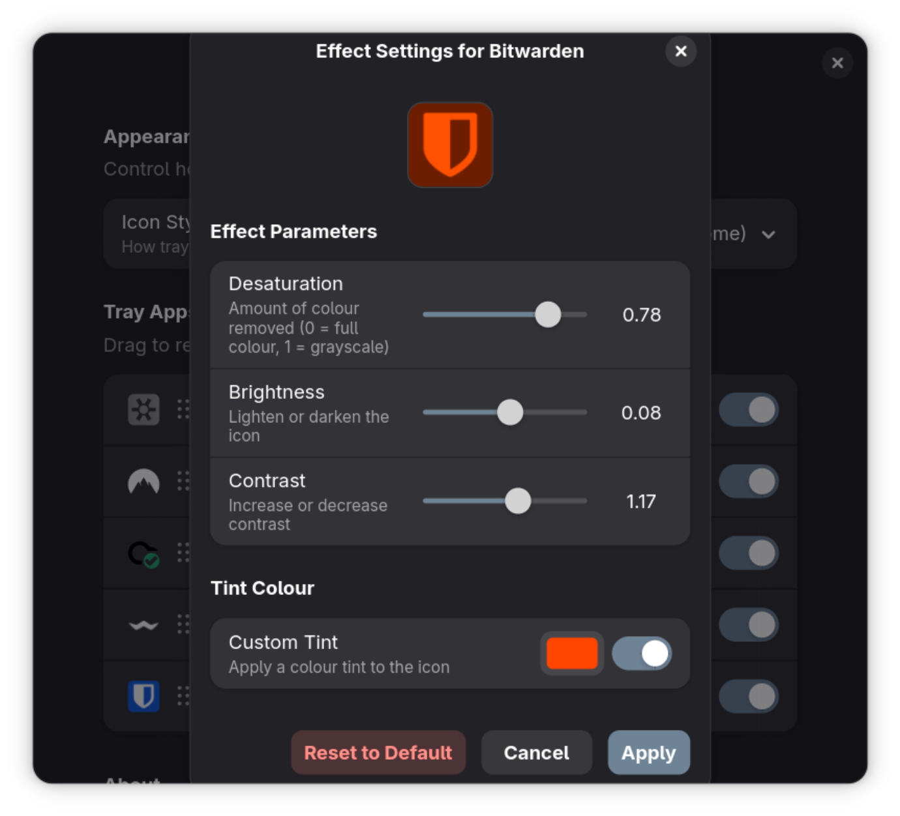

# Status Tray

A GNOME Shell extension that brings back the system tray for applications using StatusNotifierItem (AppIndicator/SNI) protocol.

   

## Features

- **Zero Configuration** - Works out of the box, no external daemon required
- **Automatic Discovery** - Finds and displays all tray icons automatically
- **Native Menus** - Full support for application context menus via DBusMenu
- **Dual Icon Modes** - Choose between symbolic (monochrome) or original (colored) icons
- **Highly Customizable** - Per-app icon overrides, effects, and ordering
- **Drag & Drop Reordering** - Arrange tray icons in your preferred order
- **Live Updates** - All changes apply instantly without restart

## Compatibility

| GNOME Version | Status |
|---------------|--------|
| GNOME 45 | Supported |
| GNOME 46 | Supported |
| GNOME 47 | Supported |
| GNOME 48 | Supported |
| GNOME 49 | Supported |

### Tested Applications

- Nextcloud
- Discord
- Slack
- Bitwarden
- Dropbox
- Telegram
- Steam
- And many more...

## Installation

### From extensions.gnome.org (Recommended)

<!-- TODO: Add link once published -->
Visit the [Status Tray extension page](https://extensions.gnome.org/) and click "Install".

### Manual Installation

1. Clone the repository:
   ```bash
   git clone https://github.com/keithvassallomt/status-tray.git
   cd status-tray
   ```

2. Run the install script:
   ```bash
   ./install.sh
   ```

3. Restart GNOME Shell:
   - **X11**: Press `Alt+F2`, type `r`, press Enter
   - **Wayland**: Log out and log back in

4. Enable the extension:
   ```bash
   gnome-extensions enable status-tray@keithvassallo.com
   ```

## Usage

Once installed and enabled, Status Tray automatically appears in your GNOME panel whenever an application registers a tray icon. Simply:

1. **Click** on a tray icon to open its menu
2. **Select** menu items to interact with the application



## Configuration

Access settings through GNOME Extensions app or by running:

```bash
gnome-extensions prefs status-tray@keithvassallo.com
```



### Icon Mode

Choose how tray icons are displayed:

| Mode | Description |
|------|-------------|
| **Symbolic** | Monochrome icons that match your shell theme (default) |
| **Original** | Full-color icons as provided by applications |



### App Management

- **Enable/Disable Apps** - Toggle visibility for individual applications
- **Drag & Drop** - Reorder apps by dragging the handle on the left

### Custom Icons

Override any app's icon with a system icon or custom image:

1. Click the icon picker button next to an app
2. Search for a system icon or click "Choose File..." for a custom image
3. Click "Apply" to save



### Icon Effects

Fine-tune how icons appear in symbolic mode:

- **Desaturation** - Control grayscale conversion (0% = color, 100% = grayscale)
- **Brightness** - Adjust icon brightness
- **Contrast** - Adjust icon contrast
- **Tint** - Apply a custom color tint



## How It Works

Status Tray implements the StatusNotifierItem (SNI) protocol, the modern replacement for the legacy XEmbed system tray. It provides its own `org.kde.StatusNotifierWatcher` D-Bus service, allowing applications to register tray icons directly with the extension.

### Key Technical Features

- **Self-contained** - No dependency on external daemons like `snixembed` or AppIndicator libraries
- **DBusMenu Integration** - Fetches dynamic menus directly from applications
- **Electron Support** - Handles Electron/Chromium apps that use custom icon paths
- **Flatpak Compatible** - Gracefully handles sandboxed applications

### Design Choices

- **SNI proxy first** - Uses `Gio.DBusProxy` with interface XML, falls back to direct calls for non-standard implementations
- **Name owner resolution** - Resolves well-known bus names to unique owners during registration, with sender fallback
- **Menu refresh** - Calls `AboutToShow` before `GetLayout` and keeps a placeholder until layout succeeds
- **Icon pipeline** - Prefers `IconName`, then `IconThemePath` file lookup, then `IconPixmap`

## Troubleshooting

### Icons not appearing

1. Ensure the extension is enabled:
   ```bash
   gnome-extensions list --enabled | grep status-tray
   ```

2. Check if the app is disabled in settings

3. Restart the application after enabling the extension

### Menu not opening

Some applications may take a moment to initialize their menus. If clicking has no effect:

1. Wait a few seconds and try again
2. Check application logs for errors

### Icons look wrong

1. Try switching between Symbolic and Original icon modes
2. Use the icon override feature to set a custom icon
3. Adjust icon effects for better visibility

### Viewing Logs

```bash
journalctl -f -o cat /usr/bin/gnome-shell 2>&1 | grep -i status-tray
```

## Manual Verification

1. Install and reload GNOME Shell (X11: `Alt+F2` → `r`, Wayland: log out/in).
2. Launch a known SNI app (e.g., Dropbox, Slack, Telegram) and confirm the icon appears.
3. Click the icon and verify the menu opens and actions trigger.
4. Toggle Icon Mode in preferences and confirm the icon restyles immediately.
5. Disable the app in preferences and confirm the icon hides, then re-enable.

## Contributing

Contributions are welcome! Please see the [developer documentation](docs/status-tray.md) for technical details.

### Development Setup

1. Clone and install in development mode:
   ```bash
   git clone https://github.com/keithvassallomt/status-tray.git
   cd status-tray
   ./install.sh --dev
   ```

2. Make your changes

3. Restart GNOME Shell to test

4. Submit a pull request

## License

This project is licensed under the GNU General Public License v3.0 - see the [LICENSE](LICENSE) file for details.

## Acknowledgments

- The GNOME Shell team for the excellent extension API
- The KDE team for the StatusNotifierItem specification
- The AppIndicator project for pioneering modern system tray support

---

<p align="center">
  Made with care for the GNOME community
</p>
